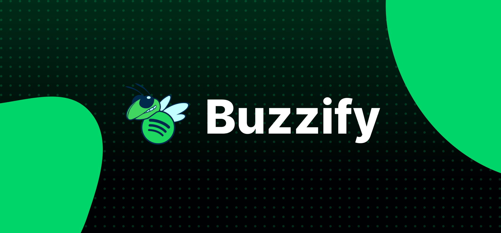

> Create, visualize, and manage your Spotify Wraps using Buzzify!

**Website: <https://sites.google.com/view/team5-proj2/our-app?authuser=0>**

## Project Title:
CS 2340 Project 2: Buzzify!

## Authors / Roles:
- **Andre Koga** - Product Owner / API
- **Xavier Genio** - Scrum Master / Documenter / Frontend
- **Matthias Druhl** - Developer / Tech Support / Backend
- **Tony Nguyen** - Developer / Backend
- **Valentina Garcia** - Developer / Frontend

## Description:
Create, visualize, and manage your Spotify Wraps using Buzzify!
Buzzify is a Spotify Wrap app designed to let users not only generate their own Spotify Wraps but also explore their friends' wraps. Simply create your account and log into your personal Spotify account to view the wraps you and your friends created!
## Software:
Designed in Figma and transcribed into Android Studio; Website made in Google Pages
